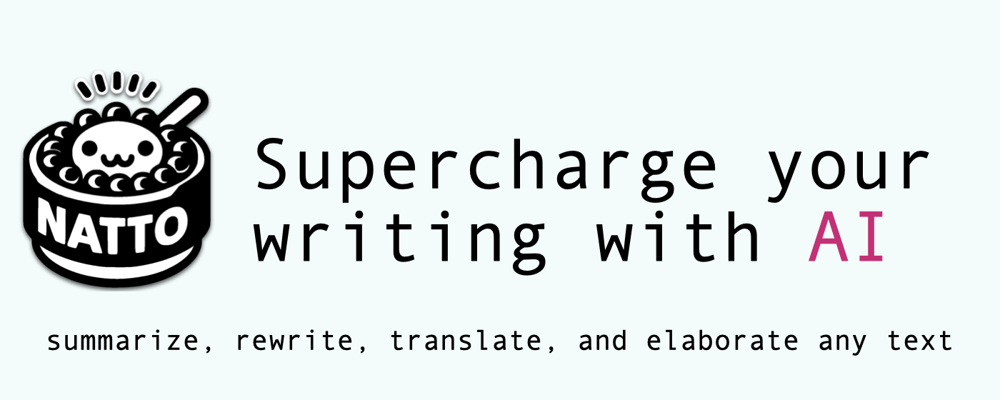
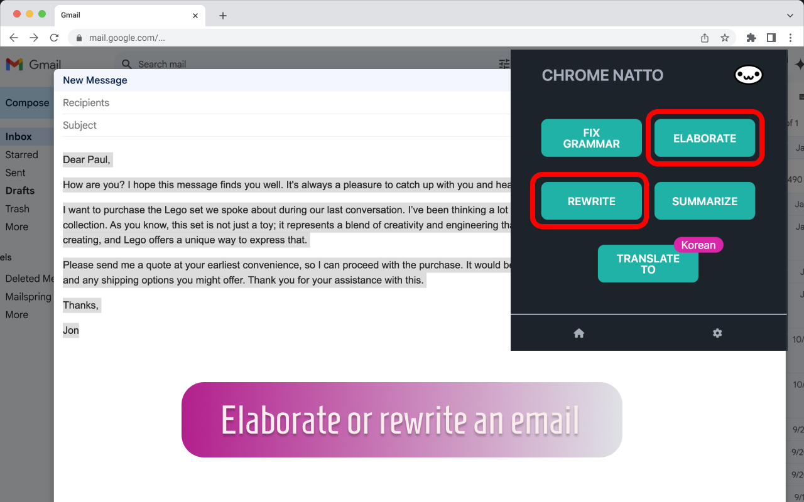
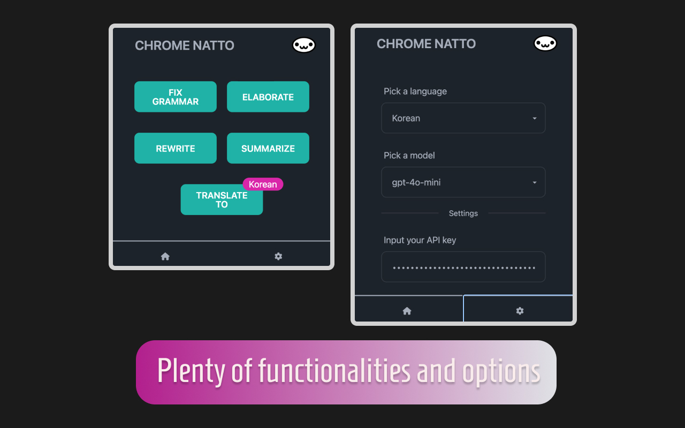

# Natto for Chrome

Supercharge your writing with AI 🚀 🤖: summarize, rewrite, translate, and elaborate any text.

Natto is an extension that provides users with the ability to highlight any section of text and easily manipulate it—fixing grammar, summarizing text, rewriting in different words, and translating it into different languages. Powering all these features is OpenAI's GPT, which enables the extension to understand and manipulate text effectively.

## 🤖 What can the extension do for you

This extension allows you to check the grammar, spelling, and syntax of a selected portion of text. The extension will automatically substitute the selection with revised text.

Similarly, you can use the extension to elaborate, rewrite, or synthesize a piece of text. Finally, you can translate the selection into another language (you can pick the language from the settings panel).

The extension is free to use, but you are required to use your own API key (see paragraph below 👇).

## 📚 How to use

Before you can get started, you must obtain an API key from OpenAI (https://platform.openai.com/settings/organization/api-keys). Copy and paste your key into the options panel. Select a model that you want to use for the AI engine. You are ready to go.
